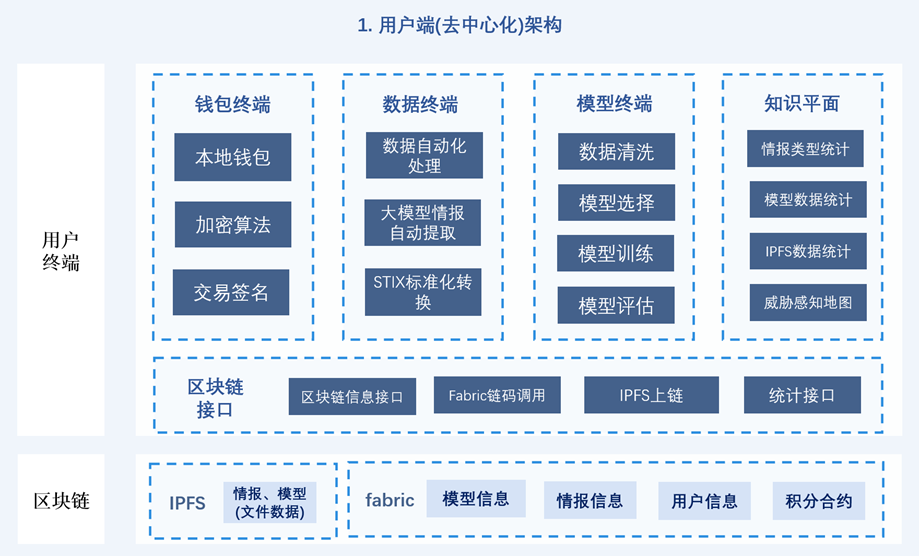
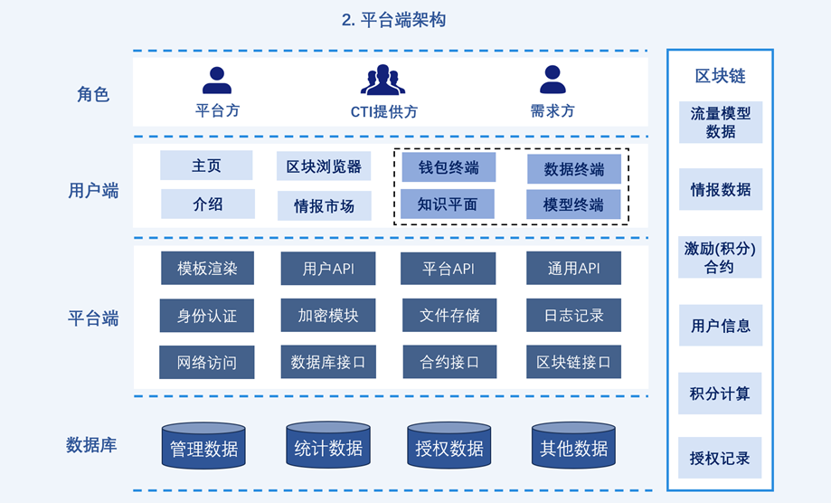
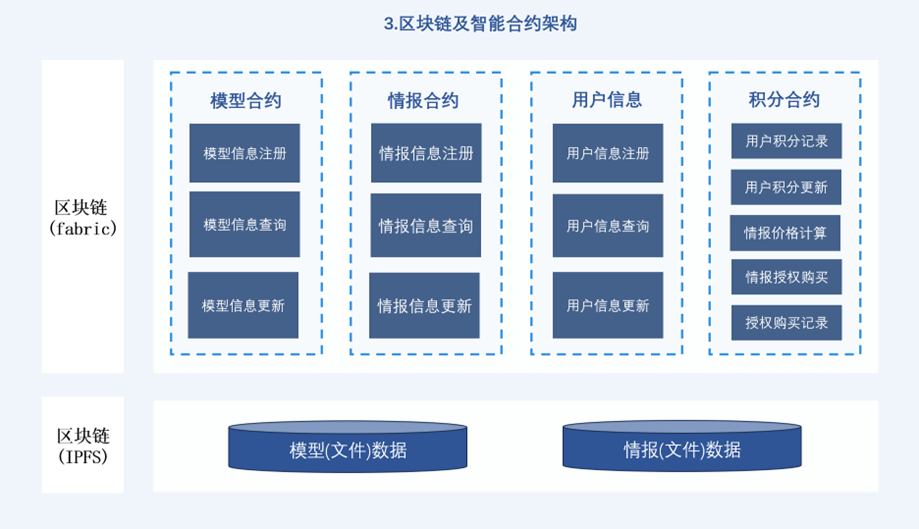
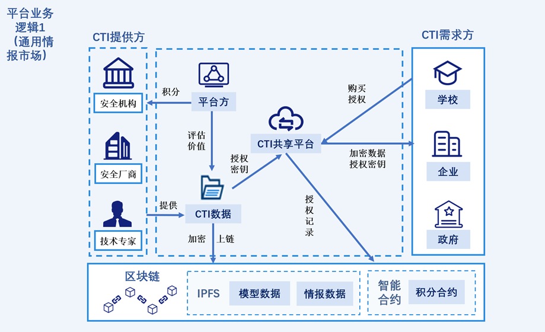

# B&R 去中心化威胁情报共享平台文档

## 1. 平台介绍

威胁情报市场是一种促进网络安全领域中信息共享的方式，它允许不同的组织之间交换有关潜在网络威胁的信息，以提高整体网络安全水平，在促进企业组织、安全机构之间的情报信息共享起到了有效作用。

为解决传统威胁情报共享模式中，数据缺乏统一标准、信息质量参差不齐、缺乏激励以及信息不透明等问题，我们以 Fabric 联盟链作为底层区块链技术，构建了一个去中心化、高效、安全、透明、多方互利的网络安全情报共享平台。共享平台采用去中心化的模式，定义了平台方、情报提供者以及需求用户三个核心角色。平台方负责情报的质量控制，确保上传的情报准确可靠；作为情报提供者可以上传情报以获取积分；作为需求用户可以通过消耗积分来获取所需的情报。
为了提高共享平台的信息透明性和公平性，我们基于联盟链底层区块链基础设施，开发了情报链上记录、情报定价、积分系统等合约。情报上链保证了情报数据信息的有效、一致和不可篡改，基于智能合约的定价、积分系统保证了定价、积分记录的公开、透明性。加密后的情报数据上传到 IPFS 上，降低了主链的存储压力，保证了存储的去中心化。

为了激励各方积极参与情报共享，定价合约基于我们构建的三方博弈数学模型。该数学模型用于计算最优情报积分价格，其考虑了情报发布数量、市场需求和服务评价等因素，能够寻找一个既能保证情报质量又能最大化各方收益的价格点。这有助于形成良性循环，推动更多有价值的情报进入共享体系。
针对情报的多样性和复杂性，平台定义了包含恶意流量、蜜罐情报、僵尸网络、应用层攻击(HTTP Flood、XSS、SQL 注入等)、开源情报等多种类型的情报。同时设计了情报标准化转换模块，标准化的情报不仅提高了情报的可操作性，也便于企业快速识别和响应未知的安全风险，从而增强整体网络安全防护能力。

此外，平台设置了模型终端模块，用户可以使用本地情报或流量数据训练模型，模型数据和模型信息上传到区块链及 IPFS 上，“模型即情报”的方式使得情报可用不可见，从而保证用户的隐私安全。

### 1.1 平台整体架构

图1.客户端整体架构

 

图2.平台整体架构

 

图3.智能合约架构

 

### 1.2 平台业务架构

图4.平台业务架构1

 

图5.平台业务架构2

## 2. client 端

## 3. bc-server 端

## 4. smartcontract 端
